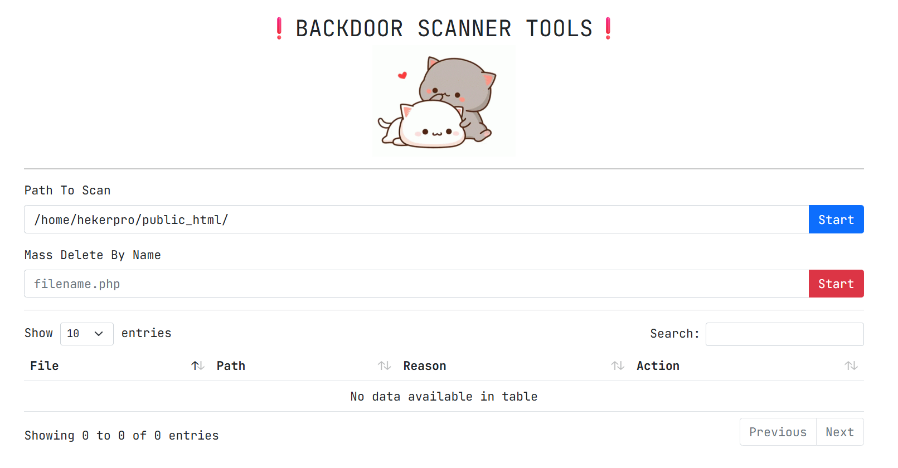

# Web Backdoor Scanner 🔍

A PHP-based tool to scan and detect potential backdoors, malicious files, and suspicious code in web directories.

## Features ✨

- Scan entire directories recursively for malicious files
- Detect common backdoor patterns and suspicious PHP functions
- Identify dangerous file extensions
- View file contents directly in browser
- Mass delete functionality for cleaning infected files
- Simple web interface with DataTables for easy navigation

## Detection Capabilities 🛡️

The scanner checks for:
- Common malicious functions (`eval`, `base64_decode`, `system`, etc.)
- Known shell patterns (b374k, indoxploit, xleet, etc.)
- Suspicious file extensions (.php1-.php9, .phtml, etc.)
- Database credentials in files
- Obfuscated code patterns

## Installation ⚙️

1. Upload the PHP file to your web server
2. Access it via browser
3. Enter the path you want to scan (defaults to current directory)

## Download Scanner 📥
Click the image below to automatically download:

## Usage 🖥️

1. Enter the directory path to scan
2. Click "Start" to begin scanning
3. Review results in the table:
   - File name
   - Full path
   - Reason for detection
   - Actions (view/delete)

For mass deletion:
1. Enter a filename pattern in the "Mass Delete" field
2. Click "Start" to delete all matching files

## Security Note 🔒

- This tool should be used responsibly and only on systems you own/have permission to scan
- Delete the scanner from your server after use to prevent unauthorized access
- The tool includes self-protection by not scanning its own file

## Contribution 🤝

Contributions are welcome! Please open an issue or pull request for:
- Adding new detection patterns
- Improving the interface
- Enhancing security features

## Disclaimer ⚠️

This tool is provided for educational and security purposes only. The author is not responsible for any misuse or damage caused by this software. Always backup your files before scanning/deleting.

    

